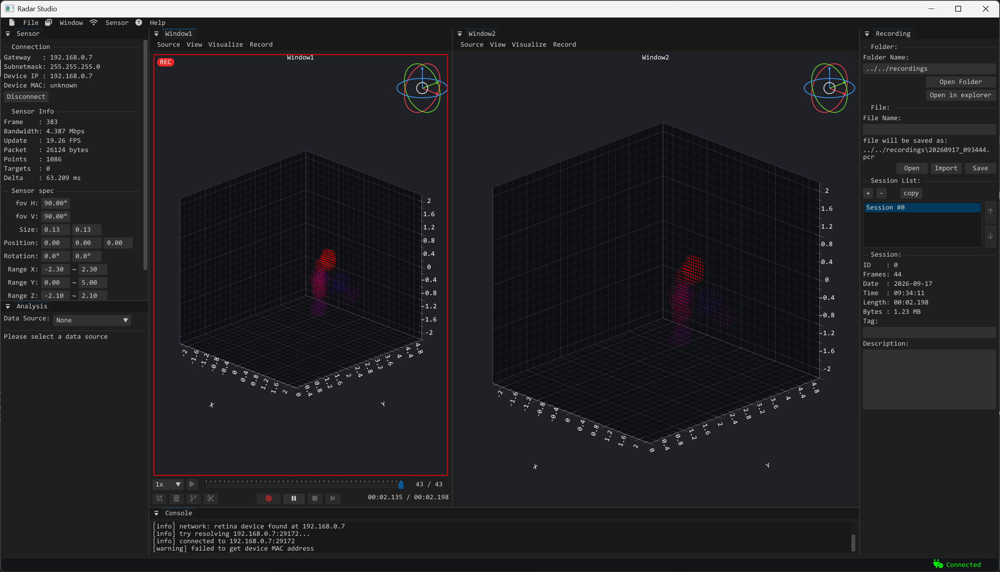
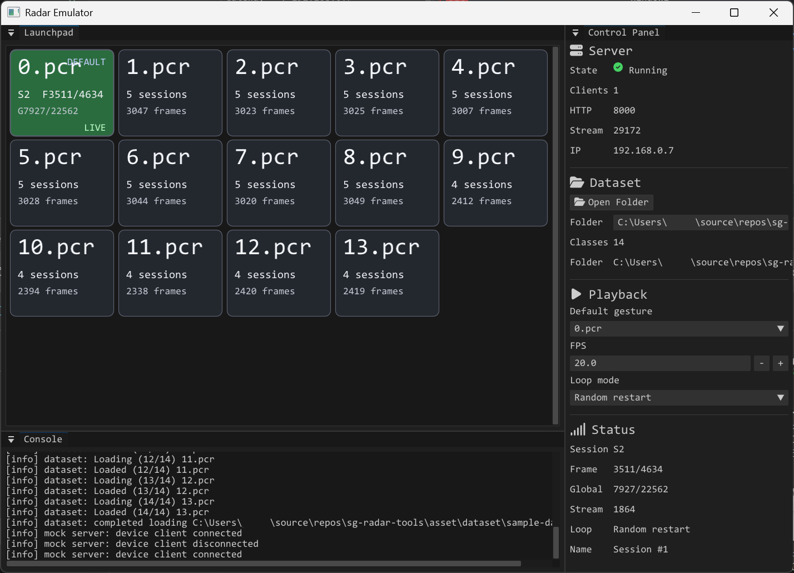

# sg-radar-tools

4D 이미징 레이더의 포인트 클라우드를 PC에서 수신/분석/녹화/편집/저장하고, 실물 센서 없이 재생 시험할 수 있는 도구의 모음입니다.


| 프로젝트               | 역할                                                  |
| ------------------ | --------------------------------------------------- |
| **Radar Studio**   | 센서 탐색/연결, 실시간 포인트 클라우드 시각화, 통계 분석, `.pcr` 녹화/재생/편집  |
| **Radar Emulator** | 녹화된 `.pcr`를 실제 센서와 같은 포트, 바이너리 포맷으로 보내는 가상 센서 에뮬레이터 |


## 요구 사항

Windows 10/11 x64에서만 빌드할 수 있습니다. [Visual Studio](https://visualstudio.microsoft.com/)가 필요하고, C++ 플랫폼 도구 집합`v145`(Visual Studio 2026)가 있어야 합니다. 서드파티 라이브러리는 `common/thirdparty/`에 모두 들어 있으므로 별도 설치는 필요없습니다.

## 빠른 시작


### 1. 클론

```
git clone https://github.com/dandevlog0206/sg-radar-tools.git
cd sg-radar-tools
```


### 2. 빌드

1. Visual Studio로 `sg-radar-tools.slnx`로드.
2. 구성을 **Release | x64**로 설정.
3. 솔루션 빌드.

빌드 후 실행 파일은 최종적으로 아래 경로에 생성됩니다.

- Radar Studio: `bin/radar-studio/radar-studio.exe`
- Radar Emulator: `bin/radar-emulator/radar-emulator.exe`

디버그 빌드는 같은 폴더에 -debug가 붙어서 생성됩니다.

- Radar Studio: `bin/radar-studio/radar-studio-debug.exe`
- Radar Emulator: `bin/radar-emulator/radar-emulator-debug.exe`


### 3. 샘플 데이터셋

아래 링크에서 샘플 데이터셋을 받아 두 프로그램에서 열 수 있습니다. 폴더 안에 `.pcr` 파일과 데이터셋에 대한 설명이 있으니 참고바랍니다.
[https://drive.dandevlog.com/s/XiTRfDSSRsnrP5t](https://drive.dandevlog.com/s/XiTRfDSSRsnrP5t)

### 4. 실행

1. Radar Emulator를 켠 뒤 우측 Control 창에서 **Open Folder**를 누르고, 내려받은 데이터셋 폴더를 엽니다.
2. Radar Studio를 켜고 왼쪽 Sensor 창에서 **Auto Connect**를 누릅니다(Radar Emulator를 가상 센서로 인식).
3. Radar Emulator의 버튼을 눌러 보면서 Studio에서 샘플 데이터가 어떻게 들어오는지 관찰합니다.

포트 29172나 8000이 이미 쓰이고 있으면 Emulator가 포트를 열지 못하니 주의바랍니다.

## 소스 코드 소개


### 센서 연결

로컬 네트워크에서 Retina-4SN을 찾고 프레임을 받는 코드입니다. 다른 C++ 앱에 통신 기능만 가져오고 싶으면 이 파일을 가져가면 됩니다. ASIO(`common/thirdparty/asio`)와 `network`가 같이 필요합니다.


| 경로                                               | 내용              |
| ------------------------------------------------ | --------------- |
| `radar-studio/src/device/retina.h`, `retina.cpp` | 센서 탐색/연결/프레임 수신 |
| `common/os/network.h`, `network.cpp`             | 소켓/네트워크 유틸      |


- `DeviceFinder::find(...)`: 동기 탐색. 탐색 전용 스레드에서 호출.
- `DeviceFinder::cancel()`: 진행 중인 탐색을 다른 스레드에서 중단.
- `DeviceClient`: 생성 시 연결을 시도하고 수신을 시작하며, `getFrames(...)`로 폴링하거나 `setOnFrame(...)`에 콜백을 연결하여 데이터를 수신.


### C++ PCR 파일 로딩

`.pcr`(Point Cloud Recording)은 레이더 포인트 클라우드 녹화용 바이너리입니다. 디스크 레이아웃은 `common/pcr/pcr_format.h`, 런타임 자료형은 `common/pcr/pcr_type.h`에 있고, 읽고 쓰는 것은 전용 클래스인 `PointCloudRecorder`(`common/pcr/point_cloud_recorder.h`)가 담당합니다.

### Python PCR 파일 로딩

전처리용 로더는 `tools/pcr/pcr_loader.py`이고, 예시 코드는 `tools/pcr/example.py`에 있습니다. Python 3.14 이상은 표준 라이브러리 `compression.zstd`를 씁니다. Python 3.14 미만에서는 `zstandard` package가 필요합니다.

```
python -m pip install zstandard
```

MSYS2 Python처럼 externally-managed environment에서는 시스템 Python에 pip로 강제 설치하지 말고 해당 환경의 package manager를 사용해야 합니다. MSYS2 MinGW64에서는 다음 명령으로 설치할 수 있습니다.

```
pacman -S --needed mingw-w64-x86_64-python-zstandard
```

```
python tools/pcr/example.py
python tools/pcr/example.py path/to/file.pcr
```

PCR의 단일 세션을 point 단위 CSV로 변환하려면 다음 명령을 사용합니다. CSV의 `timestamp_ms`는 선택한 세션의 첫 frame을 0으로 두고 이후 frame의 `delta_us`를 누적한 값입니다. PCR에 여러 세션이 있으면 0부터 시작하는 `--session` index를 지정해야 합니다.

```
python tools/pcr/pcr_to_csv.py input.pcr output.csv
python tools/pcr/pcr_to_csv.py input.pcr output.csv --session 0
```


## Radar Studio



PC에서 레이더 센서의 포인트 클라우드 데이터를 받은 뒤 분석하고 녹화/편집하는 도구입니다. 역할은 아래와 같습니다.

- 로컬 네트워크에서 센서를 찾고 자동으로 연결.
- 포인트 클라우드 실시간 수신.
- 3D 시각화(창은 최대 4개, doppler는 색, power는 불투명도).
- 프레임, 타겟별로 doppler, power 통계와 히스토그램을 표시.
- `.pcr파일 포맷을 사용하여`세션 녹화, 로딩, 재생, 편집 제공

화면은 5개의 창으로 구분됩니다.


| 창               | 역할                          |
| --------------- | --------------------------- |
| **Point Cloud** | 실시간 또는 녹화 데이터의 3D 뷰. 재생과 편집 |
| **Sensor**      | 탐색/연결, 스펙                   |
| **Analysis**    | 지금 프레임의 포인트/타겟 통계           |
| **Recording**   | 워크스페이스, 파일, 세션              |
| **Console**     | 로그                          |


## Radar Emulator



녹화해 둔 `.pcr`를 선택하여 송출하는 센서 에뮬레이터입니다. 실제 센서와 같은 장치 포트 **29172**로 같은 바이너리를 송출하므로, Radar Studio나 본인이 만든 프로그램을 센서 실물 없이 시험할 때 사용할 수 있습니다.

- 폴더 안의 `.pcr`를 버튼마다 로딩.
- 런치패드 버튼을 누르는 동안만 해당 파일의 데이터 송출.
- 아무 버튼도 안 누를 때 재생할 기본(default) 파일 지정.

화면은 세개의 창으로 구분됩니다.


| 창           | 역할                                           |
| ----------- | -------------------------------------------- |
| **런치패드**    | `.pcr`마다 버튼 하나. 누르는 동안만 재생. 파란 버튼이 기본 재생 파일. |
| **Control** | Open Folder로 폴더를 열고, 기본 파일, 프레임레이트, 루프 모드 선택 |
| **콘솔**      | 로그와 에러                                       |


## 라이선스

이 저장소의 코드는 MIT 라이선스로 공개되며 저작권은 [www.dandevlog.com에](http://www.dandevlog.com에) 있습니다([LICENSE](LICENSE)).
서드파티 라이브러리의 라이선스 파일 위치는 [common/thirdparty/NOTICE.txt](common/thirdparty/NOTICE.txt)에 모아 두었습니다.
UI 아이콘용 Font Awesome 폰트(`asset/font/fa-solid-900.ttf`)는 SIL OFL 1.1 라이선스 조건에 맞춰 [LICENSE.txt](asset/font/LICENSE.txt)를 같이 올려 두었습니다.
